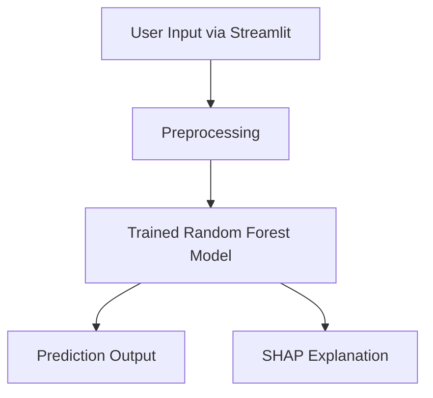

# 🏥 Hospital Readmission Risk Prediction

An intelligent web-based system that predicts the likelihood of a patient being readmitted to the hospital based on clinical and demographic data. Built using Python, Machine Learning, and Streamlit for healthcare analytics and decision support.

---

## 📌 Table of Contents

- [Introduction](#introduction)
- [Problem Statement](#problem-statement)
- [Objectives](#objectives)
- [Tech Stack](#tech-stack)
- [System Architecture](#system-architecture)
- [Features](#features)
- [How to Run](#how-to-run)
- [Screenshots](#screenshots)
- [Challenges Faced](#challenges-faced)
- [Conclusion & Learning](#conclusion--learning)
- [Contributors](#contributors)
- [License](#license)

---

## 📖 Introduction

Predicting hospital readmissions can significantly improve patient care and reduce operational costs. This project implements a machine learning model to estimate the risk of readmission within 30 days of discharge.

---

## ❗ Problem Statement

Hospital readmissions cause increased healthcare costs and indicate potential gaps in treatment quality. Early prediction can help in taking preventive measures.

---

## 🎯 Objectives

- Build a predictive model for hospital readmissions.
- Provide an intuitive UI for entering patient data.
- Offer explainability using SHAP values.
- Make healthcare analytics accessible and interactive.

---

## 🛠️ Tech Stack

- **Frontend & UI**: Streamlit
- **Backend / ML**: Python, scikit-learn
- **Visualization**: Matplotlib, SHAP
- **Others**: Pandas, NumPy, Pickle, Jupyter Notebook

---

## 🧩 System Architecture



---

## ✨ Features

- Input form for patient data
- Real-time prediction of readmission risk
- SHAP visualizations for feature impact
- Clean and responsive Streamlit interface
- Easily extendable and customizable

---

## 🚀 How to Run

1. **Clone the repo:**

```bash
git clone https://github.com/your-username/hospital-readmission-risk
cd hospital-readmission-risk
```

2. **Install dependencies:**

```bash
pip install -r requirements.txt
```

3. **Run the app:**

```bash
streamlit run app.py
```

4. **Open in browser:**  
   http://localhost:8501

---

## 📸 Screenshots

> Insert the images of:
- Streamlit homepage
- Patient input form
- Prediction result
- SHAP value explanation chart

---

## ⚠️ Challenges Faced

- Handling missing or imbalanced data
- Making SHAP outputs user-friendly
- Integrating ML model with web UI (Streamlit)
- Optimizing model performance vs interpretability

---

## ✅ Conclusion & Learning

This project improved our understanding of:
- Real-world ML deployment
- Healthcare data handling
- SHAP for explainable AI
- Building ML apps using Streamlit

---

## 👨‍💻 Contributors

- [Piyush Prajapat](https://github.com/piyushprajapat-01)

---

## 📄 License

This project is licensed under the [MIT License](LICENSE).
